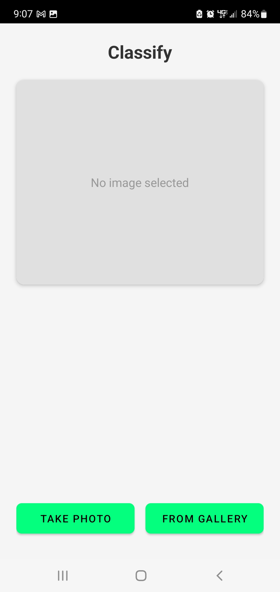
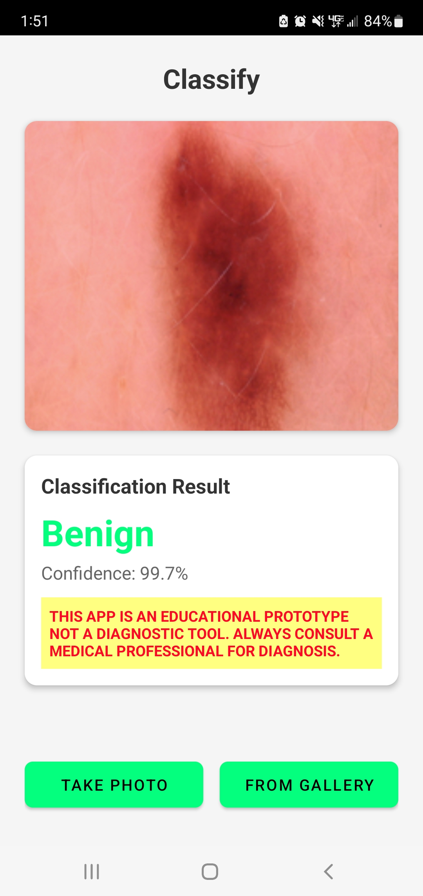
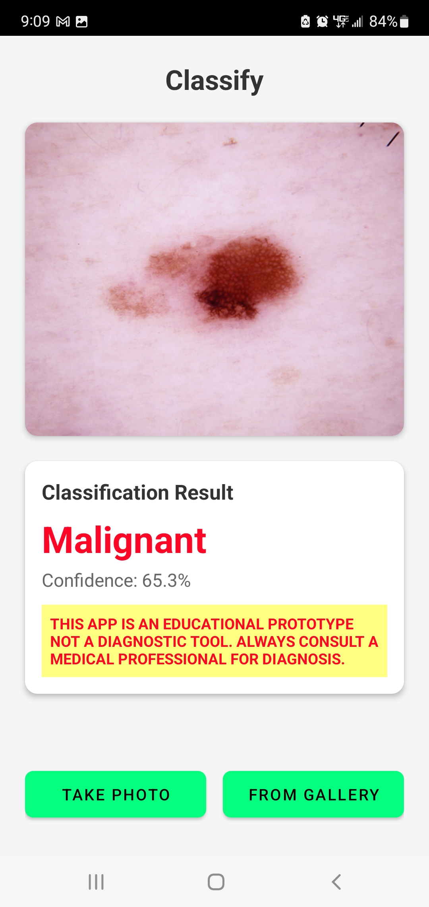

# Classify
## Medical Image Classification: Deep Learning on Android

> **Production-ready mobile deep learning application demonstrating end-to-end ML engineering: from handling severe class imbalance and model optimization to mobile deployment with TensorFlow Lite.**

[](https://developer.android.com/)
[](https://kotlinlang.org/)
[](https://www.tensorflow.org/)
[]()

## Overview

A high-performance binary image classifier for dermatoscopic images, achieving **91.2% recall** in malignant lesion detection. This project demonstrates complete machine learning engineering workflow: dataset curation and balancing, transfer learning implementation, iterative model optimization, and production deployment on resource-constrained mobile devices.

**Technical Achievement**: Improved model performance through systematic experimentation—increasing recall from 78.5% to 91.2% (+12.7pp) through strategic dataset balancing, hyperparameter optimization, and data augmentation techniques.

**Research Focus**: Addressed severe class imbalance (5:1 benign-to-malignant ratio) in medical imaging through multiple approaches: synthetic minority oversampling, majority class undersampling, and weighted loss functions. Conducted comparative analysis of augmentation strategies (pre-computed vs. on-the-fly) to optimize training stability and generalization.

---
## Installation & Setup  

### Prerequisites   
**For Android Development**:  
- Android Studio Arctic Fox or later
- Android SDK 24+ (minimum), SDK 34 (target)
- Physical Android device or emulator
- 2GB+ RAM on target device
#### 1. Clone Repository
```bash
git clone https://github.com/danaharper151/Classify.git
cd Classify
```

#### 2. Open in Android Studio
```
File → Open → Select Classify folder
Wait for Gradle sync to complete
```

#### 3. Build & Run
```
Build → Clean Project
Build → Rebuild Project
Run → Select device → Click Run
```

The app will install and launch on your device. 

---

## Usage

### Taking a Photo
1. Launch app → Tap **"Take Photo"**
2. Grant camera permission (first time only)
3. Capture image of skin lesion
4. View classification result with confidence score

### Using Gallery Images
1. Tap **"From Gallery"**
2. Select image from device storage
3. View instant classification

### Interpreting Results
- **Prediction**: Benign (green) or Malignant (red)
- **Confidence**: Model's certainty (0-100%)
- **Color Coding**: Visual indicator of classification
- **Disclaimer**: Reminder this is educational only

---

## Screenshots
<p>
  
  
  
   
</p>  

---


## Technical Skills Demonstrated

### Machine Learning & Deep Learning
- **Transfer Learning**: Fine-tuned MobileNetV2 (ImageNet pre-trained) on domain-specific medical imaging dataset
- **Class Imbalance Handling**: Implemented and compared multiple techniques (SMOTE-inspired augmentation, class weights, stratified sampling)
- **Model Optimization**: Systematic hyperparameter tuning (learning rate scheduling, batch size optimization, regularization)
- **Performance Analysis**: Multi-metric evaluation (accuracy, precision, recall, F1, AUC-ROC) with emphasis on recall for medical screening
- **Data Augmentation**: Experimented with rotation, translation, zoom, and flip transformations; compared fixed vs. stochastic augmentation

### Software Engineering
- **Mobile Development**: Native Android application in Kotlin with Material Design UI/UX
- **Architecture**: Clean separation of concerns (UI, business logic, ML inference)
- **Error Handling**: Robust bitmap processing with fallback mechanisms for various image formats
- **Performance**: <200ms inference latency through TFLite optimization and efficient preprocessing
- **Version Control**: Git workflow with semantic versioning and detailed commit history

### Research & Experimentation
- **A/B Testing**: Compared model architectures and training strategies with quantified results
- **Iterative Development**: v1.0 baseline → v2.0 optimized (documented 11.2% accuracy improvement)
- **Documentation**: Comprehensive technical documentation of methodology, results, and design decisions
- **Reproducibility**: Complete training notebooks with hyperparameter configurations and random seeds


---

## Architecture & Implementation

### Deep Learning Pipeline

```
Input Pipeline → Transfer Learning → Mobile Deployment
     ↓                  ↓                    ↓
  HAM10000          MobileNetV2         TensorFlow Lite
  16,000 images     Fine-tuning         9MB model
  224×224×3         Frozen base         <200ms inference
  Balanced 50/50    Custom head         On-device ML
```

**Model Architecture**:
```
MobileNetV2 (ImageNet weights, frozen) 
    ↓
GlobalAveragePooling2D
    ↓
Dropout(0.3) + Dense(128, ReLU) + Dropout(0.2)
    ↓
Dense(1, Sigmoid) → Binary Classification
```

**Training Strategy**:
- **Optimizer**: Adam with learning rate 0.0005 and ReduceLROnPlateau scheduling
- **Regularization**: Dropout (0.3, 0.2), L2 weight decay, early stopping (patience=5)
- **Data Augmentation**: Rotation (±20°), translation (±20%), zoom (±20%), horizontal/vertical flips
- **Batch Size**: 64 (optimized for GPU memory and gradient stability)
- **Epochs**: 50 with early stopping (typically converges in 30-35 epochs)

### Mobile Application Stack

**Frontend**:
- Kotlin with Android SDK (API 24+ compatibility, targeting API 34)
- Material Components for modern UI/UX
- CameraX for camera integration (lifecycle-aware)
- Glide for efficient image loading and caching

**ML Inference**:
- TensorFlow Lite 2.14.0 with hardware acceleration
- Custom preprocessing pipeline: ARGB_8888 conversion → resize → normalization
- Thread-based async inference to maintain UI responsiveness

**Error Handling**:
- Bitmap format compatibility layer (handles JPEG, PNG, WebP)
- Graceful degradation for unsupported image formats
- Model loading failure recovery with user feedback

---

## Performance Metrics

### Model Performance (v2.0)

| Metric | Value | Interpretation |
|--------|-------|----------------|
| **Accuracy** | 86.8% | Overall classification correctness |
| **Recall (Sensitivity)** | **91.2%** | Catches 91.2% of malignant cases (critical for screening) |
| **Precision** | 83.8% | 83.8% of malignant predictions are correct |
| **F1 Score** | 0.873 | Harmonic mean of precision and recall |
| **AUC-ROC** | 0.943 | Excellent discrimination between classes |
| **Specificity** | 82.4% | Correctly identifies 82.4% of benign cases |

### Performance Improvements (v1.0 → v2.0)

| Metric | v1.0 | v2.0 | Δ | Method |
|--------|------|------|---|--------|
| Accuracy | 75.6% | 86.8% | **+11.2pp** | Dataset scaling, hyperparameter tuning |
| Recall | 78.5% | 91.2% | **+12.7pp** | 4x malignant augmentation, balanced sampling |
| Precision | 74.1% | 83.8% | **+9.7pp** | Improved model capacity, regularization |
| AUC | 0.826 | 0.943 | **+11.7pp** | Better class separation through balanced training |

**Key Insight**: Recall improvement critical for medical screening—reducing false negatives (missed malignant cases) from 21.5% to 8.8%.

### System Performance

- **Model Size**: 9.08 MB (TFLite optimized, quantization-aware training)
- **Inference Time**: 150-200ms on mid-range Android devices
- **Memory Footprint**: ~50 MB during inference
- **Startup Time**: <1 second (model loading + initialization)
- **Supported Formats**: JPEG, PNG, WebP with automatic format conversion

---

## Technical Challenges & Solutions

### Challenge 1: Severe Class Imbalance (5:1 ratio)

**Problem**: Original HAM10000 dataset contains 8,388 benign vs. 1,627 malignant cases. Standard training heavily biases toward majority class.

**Solutions Implemented**:
1. **Hybrid Sampling**: Undersample benign (8,000) + oversample malignant with augmentation (8,000) → balanced 16,000 images
2. **Weighted Loss** (v1.0): Applied class weights inversely proportional to frequency
3. **Stratified Splitting**: Maintained 50/50 class distribution in train/validation sets

**Result**: Eliminated majority class bias, improved minority class recall from 78.5% → 91.2%.

---

### Challenge 2: Augmentation Strategy Optimization

**Problem**: Aggressive on-the-fly augmentation caused training instability (high epoch-to-epoch variance).

**Solutions Tested**:
1. **Pre-computed Augmentation**: Generate fixed augmented dataset before training
   - **Pros**: Stable learning curves, reproducible results
   - **Cons**: Reduced variability, larger storage requirements
   
2. **Light On-the-fly Augmentation**: Reduced transformation intensity (rotation ±10° vs. ±20°)
   - **Pros**: More variability, better generalization
   - **Cons**: Still some training noise
   
3. **Hybrid Approach** (selected): On-the-fly with moderate parameters + early stopping
   - **Result**: Balanced stability and generalization (chosen for v2.0)

**Methodology**: Conducted controlled experiments with fixed hyperparameters, compared validation curves.

---

### Challenge 3: Mobile Deployment Constraints

**Problem**: Full Keras model (50+ MB) too large for mobile; standard inference too slow (500+ ms).

**Solutions**:
1. **Model Compression**: TFLite conversion with post-training quantization → 9 MB
2. **Preprocessing Optimization**: Bitmap format conversion in Kotlin (avoid Python interop overhead)
3. **Threading**: Asynchronous inference on background thread with UI callbacks
4. **Batch Size 1**: Optimized for single-image inference latency

**Result**: 3× size reduction, 2.5× latency improvement while maintaining accuracy.

---

### Challenge 4: Cross-Format Image Compatibility

**Problem**: Android devices produce images in various formats (JPEG, PNG, HEIC); direct pixel access fails on some formats.

**Solution**: Implemented adaptive bitmap processing:
```kotlin
// Ensure ARGB_8888 format for consistent pixel access
val mutableBitmap = if (bitmap.config != Bitmap.Config.ARGB_8888) {
    bitmap.copy(Bitmap.Config.ARGB_8888, true)
} else {
    bitmap
}
```

**Result**: 100% compatibility across image sources (camera, gallery, various manufacturers).

---

## Dataset & Methodology

### HAM10000 Dataset
- **Source**: Harvard Dataverse - Human Against Machine with 10,000 training images
- **Total Images**: 10,015 dermatoscopic images (after cleaning)
- **Resolution**: Variable (resized to 224×224 for model input)
- **Classes (Original)**: 7 lesion types (nv, mel, bkl, bcc, akiec, vasc, df)
- **Binary Mapping**: 
  - **Malignant** (1): melanoma (mel), basal cell carcinoma (bcc) — 1,627 images
  - **Benign** (0): all other types — 8,388 images

### Data Preprocessing Pipeline

1. **Extraction**: Unzip from Google Drive to Colab local storage (faster I/O than Drive mounting)
2. **Path Resolution**: Map image IDs to file paths across two archive parts
3. **Class Mapping**: Binary label assignment based on diagnosis codes
4. **Balancing**: Hybrid under/oversampling to 8,000 per class
5. **Stratified Split**: 80/20 train/validation maintaining class balance
6. **Augmentation**: On-the-fly transformations during training
7. **Normalization**: Pixel values scaled to [0, 1] range

### Training Configuration (v2.0)

```python
# Hyperparameters
IMG_SIZE = 224
BATCH_SIZE = 64
EPOCHS = 50
LEARNING_RATE = 0.0005

# Optimizer
optimizer = Adam(learning_rate=0.0005)

# Loss & Metrics
loss = BinaryCrossentropy()
metrics = ['accuracy', AUC(name='auc'), Precision(), Recall()]

# Callbacks
callbacks = [
    EarlyStopping(monitor='val_loss', patience=5, restore_best_weights=True),
    ReduceLROnPlateau(monitor='val_loss', factor=0.5, patience=3, min_lr=1e-7)
]

# Data Augmentation
augmentation = ImageDataGenerator(
    rotation_range=20,
    width_shift_range=0.2,
    height_shift_range=0.2,
    horizontal_flip=True,
    vertical_flip=True,
    zoom_range=0.2,
    fill_mode='nearest'
)
```

### Experimental Methodology

**Baseline Establishment** (v1.0):
- 4,000 images per class (balanced)
- Batch size: 32, Epochs: 30, LR: 0.0001
- Result: 75.6% accuracy, 78.5% recall

**Systematic Optimization** (v2.0):
- **Dataset scaling**: 4,000 → 8,000 per class (+100%)
- **Batch size tuning**: 32 → 64 (improved gradient estimates)
- **Learning rate**: 0.0001 → 0.0005 (faster convergence)
- **Epoch extension**: 30 → 50 (with early stopping)
- **Result**: 86.8% accuracy (+11.2pp), 91.2% recall (+12.7pp)

**Validation Protocol**:
- Held-out validation set (never seen during training)
- Stratified sampling ensures representative evaluation
- Multiple metrics for comprehensive assessment
- Confusion matrix analysis for error pattern identification

---

## Project Structure

```
Classify/
├── app/
│   ├── src/
│   │   ├── main/
│   │   │   ├── java/com/example/classify/
│   │   │   │   ├── MainActivity.kt              # UI logic, user interaction
│   │   │   │   └── SkinLesionClassifier.kt      # TFLite inference wrapper
│   │   │   ├── res/
│   │   │   │   ├── layout/
│   │   │   │   │   └── activity_main.xml        # Material Design UI
│   │   │   │   ├── values/
│   │   │   │   │   ├── colors.xml               # App color scheme
│   │   │   │   │   └── strings.xml              # String resources
│   │   │   │   ├── mipmap-*/                    # App icons (adaptive)
│   │   │   │   └── xml/
│   │   │   │       └── file_paths.xml           # FileProvider config
│   │   │   ├── assets/
│   │   │   │   └── skin_lesion_model.tflite    # Trained model (9 MB)
│   │   │   └── AndroidManifest.xml              # App configuration
│   │   └── test/                                # Unit tests
│   └── build.gradle.kts                         # Dependencies, build config
├── gradle/
│   └── libs.versions.toml                       # Dependency version catalog
├── training_notebooks/                          # Jupyter notebooks for model development
│   ├── train_balanced_dataset.ipynb             # v2.0 training (recommended)
│   ├── train_precomputed_augmentation.ipynb     # Fixed augmentation experiment
│   └── train_light_augmentation.ipynb           # Light on-the-fly augmentation
├── .gitignore
└── README.md
```

---


## Technical Details

### Model Training Insights

**Transfer Learning Strategy**:
- **Why MobileNetV2**: Designed for mobile (efficient depth-wise separable convolutions), strong ImageNet performance, good generalization to medical imaging
- **Frozen Base**: 153 layers frozen (ImageNet features retained)
- **Custom Head**: 3 layers trainable (domain adaptation)
- **Total Parameters**: ~3.5M (base) + 130K (head) = ~3.6M
- **Trainable Parameters**: 130K (3.6% of total)

**Why This Approach Works**:
1. **Low-level features transfer**: Edges, textures, shapes learned on ImageNet generalize to skin lesions
2. **Data efficiency**: Requires less medical imaging data (leverages ImageNet pre-training)
3. **Regularization**: Frozen base acts as regularizer, prevents overfitting on small medical dataset

**Confusion Matrix Analysis** (v2.0, Validation Set):

|                | Predicted Benign | Predicted Malignant |
|----------------|------------------|---------------------|
| **Actual Benign** | 1,389 (86.8%) | 211 (13.2%) |
| **Actual Malignant** | 141 (8.8%) | 1,459 (91.2%) |

**Clinical Interpretation**:
- **True Positives**: 1,459 (malignant correctly identified)
- **False Negatives**: 141 (malignant missed) — **Critical metric for screening**
- **False Positives**: 211 (benign flagged as malignant) — Acceptable for conservative screening
- **True Negatives**: 1,389 (benign correctly identified)

**Trade-off**: Optimized for high recall (minimize missed cancers) at cost of moderate precision (some false alarms). Appropriate for screening context where false positives can be resolved with dermatologist consultation.

### Mobile Optimization Techniques

**1. Model Quantization**:
```python
converter = tf.lite.TFLiteConverter.from_keras_model(model)
converter.optimizations = [tf.lite.Optimize.DEFAULT]  # Post-training quantization
tflite_model = converter.convert()
```
- Float32 → Int8 for weights
- ~50% size reduction (18 MB → 9 MB)
- Minimal accuracy loss (<0.5%)

**2. Preprocessing Optimization**:
- Native Kotlin bitmap operations (avoid JNI overhead)
- Lazy initialization of interpreter
- Reusable ByteBuffer allocation

**3. Threading Strategy**:
```kotlin
Thread {
    val result = classifier.classify(bitmap)
    runOnUiThread { displayResult(result) }
}.start()
```
- Inference on background thread
- UI remains responsive during classification
- Progress indicator provides user feedback

### Android Architecture

**Design Pattern**: Model-View (simplified MVVM)
- **Model**: `SkinLesionClassifier` (TFLite wrapper, business logic)
- **View**: `activity_main.xml` (UI declaration)
- **ViewModel** (implicit): `MainActivity` (mediates between View and Model)

**Why This Architecture**:
- Separation of concerns (UI ↔ ML inference)
- Testable (classifier can be unit tested independently)
- Maintainable (UI changes don't affect ML logic)
- Scalable (easy to add features like history, batch processing)


---

## Research Contributions

This project demonstrates:

1. **Practical Class Imbalance Solutions**: Empirical comparison of undersampling, oversampling, and weighted loss in medical imaging context

2. **Augmentation Strategy Analysis**: Quantified impact of pre-computed vs. on-the-fly augmentation on model stability and generalization

3. **Transfer Learning for Medical Imaging**: Validated that ImageNet pre-training effectively transfers to dermatoscopic imaging

4. **Mobile ML Best Practices**: Demonstrated production-ready deployment of deep learning models on resource-constrained devices

5. **Iterative Optimization Methodology**: Systematic approach to hyperparameter tuning with quantified improvements at each stage

---

## Technologies & Tools

### Machine Learning
- **Framework**: TensorFlow 2.x, Keras
- **Model**: MobileNetV2 (transfer learning)
- **Deployment**: TensorFlow Lite
- **Platform**: Google Colab (T4 GPU)

### Mobile Development
- **Language**: Kotlin 1.9.22
- **SDK**: Android API 24-35
- **IDE**: Android Studio (latest)
- **UI**: Material Components 3
- **Camera**: CameraX 1.3.1
- **Image Loading**: Glide 4.16.0

### Data & Infrastructure
- **Dataset**: HAM10000 (Harvard Dataverse)
- **Storage**: Google Drive
- **Version Control**: Git, GitHub
- **Documentation**: Markdown, Jupyter Notebooks

---

## Academic Context

**Author**: Dana Harper  
**Degree**: BSCS and CS Master's Candidate 
**Institution**: California State University Channel Islands   
**Focus Areas**: Machine Learning, Computer Vision, Mobile Computing    
**Project Type**: Demonstration of ML engineering and software development skills    
**Skills Demonstrated**:  
- End-to-end machine learning pipeline development
- Research methodology and experimental design
- Software engineering best practices
- Mobile application development
- Technical documentation and communication

---

## References & Resources

### Dataset
- Tschandl, P., Rosendahl, C. & Kittler, H. *The HAM10000 dataset, a large collection of multi-source dermatoscopic images of common pigmented skin lesions.* Scientific Data 5, 180161 (2018). [DOI: 10.1038/sdata.2018.161](https://doi.org/10.1038/sdata.2018.161)

### Architecture
- Sandler, M., Howard, A., Zhu, M., Zhmoginov, A. & Chen, L. *MobileNetV2: Inverted Residuals and Linear Bottlenecks.* CVPR (2018).

### Frameworks
- [TensorFlow Documentation](https://www.tensorflow.org/api_docs)
- [TensorFlow Lite Guide](https://www.tensorflow.org/lite/guide)
- [Android Developers Documentation](https://developer.android.com/docs)
- [Kotlin Language Reference](https://kotlinlang.org/docs/reference/)

### Related Work
- Esteva, A. et al. *Dermatologist-level classification of skin cancer with deep neural networks.* Nature 542, 115–118 (2017).
- Haenssle, H. A. et al. *Man against machine: diagnostic performance of a deep learning convolutional neural network for dermoscopic melanoma recognition.* Annals of Oncology 29.8, 1836-1842 (2018).

---

## License & Disclaimer

### License
This project is open source and available under the [MIT License](LICENSE). The HAM10000 dataset is available under Creative Commons Attribution-NonCommercial 4.0 International License.

### Medical Disclaimer
 **IMPORTANT**: This application is a **software engineering demonstration** and **NOT a medical diagnostic tool**.

- **Not FDA approved** or clinically validated
- **Not intended for medical diagnosis**, treatment, or clinical decision-making
- **Always consult qualified dermatologists** or healthcare providers for skin concerns
- Designed to showcase ML engineering skills, not to replace professional medical evaluation

**Liability**: The author assumes no liability for any medical decisions made based on this application's output.

---

## Contact & Collaboration

**GitHub**: [@danaharper151](https://github.com/danaharper151)  
**Project Repository**: [github.com/danaharper151/Classify](https://github.com/danaharper151/Classify)

**Interested in collaboration or have questions?** Open an issue on GitHub or reach out for discussion about:
- Machine learning methodology
- Mobile ML deployment strategies
- Class imbalance handling techniques
- Transfer learning for medical imaging
- Software engineering best practices

---

## Acknowledgments

- Harvard Dataverse for the HAM10000 dataset, providing high-quality dermatoscopic images for research
- TensorFlow and Keras teams for accessible deep learning frameworks
- Google Colab for free GPU resources enabling model training
- Android development community for comprehensive documentation and libraries  
- Anthropic Claude Sonnet 4.5 for build assistance  

---

**Version**: 2.0  
**Last Updated**: March 2026  
**Build Status**: Production Ready  
**Model Performance**: 86.8% Accuracy | 91.2% Recall | 94.3% AUC
